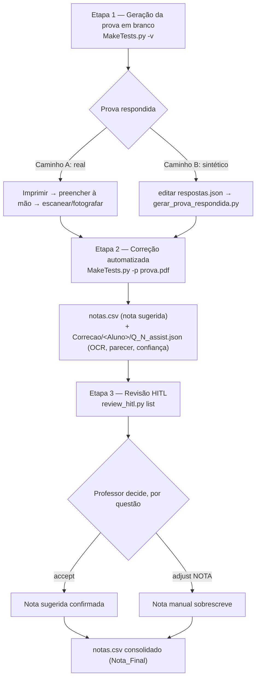

# Guia de teste ao vivo — apresentação Q2 ao professor

**Branch:** `pgc/testes-pos-implementacao-v1` (e eventuais `-v2`, `-v3`...). Este guia, `gerar_prova_respondida.py` e `test-quick/respostas.json` são artefatos de teste — não vão para a branch de entrega Q2 (ver `inventario-arquivos-entrega-q2.md`, fora deste repositório, categoria "Guia/Validação/Planos/Testes").

**Objetivo:** roteiro operacional para demonstrar e testar ao vivo o fluxo completo da extensão dissertativa (Fases 0–7), com controle independente sobre cada etapa: geração da prova, geração da prova respondida, correção automatizada e revisão final (HITL).

---

## Fluxograma



Versão texto (caso o mermaid não renderize):

```
[1. Gerar prova em branco] -> [1.5 Prova respondida: real OU sintética] -> [2. Corrigir] -> [sidecar + notas.csv] -> [3. HITL: list -> accept/adjust] -> [notas.csv consolidado]
```

---

## Etapa 1 — Geração da prova em branco

**Onde controlar:**

| O quê | Arquivo |
|---|---|
| Quais questões entram, pesos | `test-quick/config.json` → `questions.select` |
| Nome dos PDFs gerados | `test-quick/config.json` → `output` (hoje: `aed.pdf` / `aed_gabarito.pdf`) |
| Quem são os alunos | `test-quick/Students.csv` |
| Enunciado e rubrica de cada questão | `test-quick/Questions/Easy/alternative_example.py` (objetiva), `test-quick/Questions/Hard/dissertative_example.py` (dissertativa) |

**Comando:**

```bash
cd test-quick
python3 ../MakeTests.py -v
```

**Saída:** `aed.pdf` (uma prova por aluno, com QR code de identificação) e `aed_gabarito.pdf`.

### Trocando o tema da prova

Só 3 pontos precisam ser tocados — `gerar_prova_respondida.py` não precisa de nenhum ajuste (ele deriva do `config.json` os nomes de saída e o tipo de cada questão, e lê a alternativa correta das flags `True` do próprio `.py` da questão):

1. **Questões**: criar/editar os `.py` em `test-quick/Questions/` (objetiva: lista `options` com a flag `True` na correta; dissertativa: `statement` + `rubric`).
2. **`test-quick/config.json`**: apontar `questions.select` para os novos caminhos; opcionalmente trocar `output` para renomear os PDFs.
3. **`test-quick/respostas.json`**: atualizar o texto da resposta dissertativa para o novo tema (`Q1`/`Q2`... seguem a ordem de `questions.select`).

---

## Etapa 1.5 — Prova respondida

Dois caminhos — escolha conforme o momento (ensaio vs. apresentação real):

### Caminho A — Real (recomendado para o dia da apresentação)

1. Imprimir `aed.pdf` (ou exibir na tela).
2. Preencher à mão: marcar a bolha da questão objetiva, escrever a resposta dissertativa.
3. Escanear ou fotografar (app de scanner do celular) e exportar como PDF.

Vantagem: é a demonstração mais convincente — OCR real sobre caligrafia real, não simulação.

### Caminho B — Sintético (para ensaiar sem precisar imprimir/escanear toda vez)

1. Editar `test-quick/respostas.json` — controla, por aluno, a resposta da questão objetiva (`"correta"`/`"errada"`/`"branco"`) e da dissertativa (texto + estilo de letra `"forma"`/`"cursiva"`, ou `"branco"`). Exemplo já incluso no arquivo. Textos longos são quebrados em linhas automaticamente para caber na área de resposta (use `\n` para forçar parágrafo).
2. Rodar:

```bash
python3 gerar_prova_respondida.py
```

3. Saída (nomes derivados de `output.tests` do `config.json`):
   - `test-quick/aed_respondida.pdf` — PDF digital (direto do pdflatex), para conferência visual;
   - `test-quick/aed_respondida_img.pdf` — o mesmo rasterizado a 300dpi, simulando o "PDF escaneado" — **é este que vai para a Etapa 2**.

Vantagem: repetível em segundos, dá controle total sobre quem acerta/erra/deixa em branco em cada rodada de ensaio.

---

## Etapa 2 — Correção automatizada

```bash
cd test-quick   # se ainda não estiver

# Ensaio, sem gastar cota de API:
LLM_PROVIDER=mock python3 ../MakeTests.py -vv -p aed_respondida_img.pdf

# Apresentação real (usa o provider configurado em .env, hoje Gemini):
python3 ../MakeTests.py -vv -p aed_respondida_img.pdf
```

> **Atenção:** o `MakeTests.py` procura `config.json` no diretório atual (ou no caminho passado como último argumento) e resolve **todos** os caminhos — inclusive o do `-p` — relativos à pasta do config. Para rodar sem `cd test-quick`:
>
> ```bash
> python3 MakeTests.py -vv -p aed_respondida_img.pdf test-quick/config.json
> ```

**O que acontece:** o sistema lê o QR code de cada área de resposta, roda OCR (Tesseract) na questão dissertativa, chama o LLM (mock ou real conforme `LLM_PROVIDER`), calcula o score de confiança e grava:

- `Correcao/notas.csv` — nota sugerida já preenchida por questão.
- `Correcao/<Aluno>/Q_2_assist.json` — sidecar com texto OCR (raw e normalizado), nota sugerida, parecer (`rationale`), confiança e `status_hitl="pendente"`.

---

## Etapa 3 — Revisão HITL e nota final

```bash
cd test-quick   # se ainda não estiver
python3 ../review_hitl.py list
python3 ../review_hitl.py accept "<Nome do Aluno>" <número da questão>
python3 ../review_hitl.py adjust "<Nome do Aluno>" <número da questão> <nota manual>
```

> **Atenção:** assim como o `MakeTests.py`, o `review_hitl.py` procura `config.json` no diretório atual por padrão. Para rodar sem `cd test-quick`, use `--config` — mas ele é um argumento do parser **principal**, então tem que vir **antes** do subcomando (`list`/`accept`/`adjust`), senão o argparse recusa:
>
> ```bash
> python3 review_hitl.py --config test-quick/config.json list
> python3 review_hitl.py --config test-quick/config.json accept "<Nome do Aluno>" <número da questão>
> ```

`list` ordena por confiança (menor confiança primeiro — o que mais precisa de atenção do professor). `accept` confirma a nota sugerida pela IA como final; `adjust` sobrescreve com uma nota definida pelo professor. Ambos atualizam `notas.csv` (`Nota_Final`) e o sidecar (`status_hitl`).

---

## Limitação conhecida: letra cursiva (achado dos testes Q2)

Medido no teste ao vivo de 2026-07-09 (mesma resposta, pipeline completo com scanner simulado a 300dpi), consistente com o experimento da Fase 7 (`experiments/ocr_styles_results.csv`):

| Estilo de letra | CER (erro por caractere) | Exemplo de erro |
|---|---|---|
| Letra de forma | ~0,6% | `0` lido como `O` |
| Cursiva | ~5,5% | `arvores`→`amores`, `0 e 1`→`O e À`, `numeros`→`numenas` |

O OCR (Tesseract) é um motor de texto impresso, não de manuscrito: cursiva degrada a segmentação de caracteres, e **dígitos no meio de prosa viram letras** (`0`→`O`, `1`→`l`) — o que pode custar pontos quando o número carrega o critério da rubrica ("no máximo **2** filhos").

**Política adotada:** cursiva continua permitida, mas:

1. Toda questão dissertativa agora imprime, abaixo do enunciado, o aviso *"Responda preferencialmente em letra de forma: letra cursiva pode reduzir a precisão da correção automática."* (centralizado em `QuestionDissertative.handwriting_notice` no `MakeTests.py`; uma subclasse pode definir `None` para omitir).
2. A rede de segurança já existente cobre o resto: respostas com OCR ruim derrubam o score de confiança (`ocr_confianca_baixa`, `ocr_caracteres_duvidosos`) e sobem para o topo da fila do HITL — no caso medido, confiança 66/"media" com `review_recommended=true`.

Esse é um bom resultado para relatar no Q2: limite quantificado do OCR + mitigação dupla (aviso preventivo na prova, revisão humana priorizada por confiança).

---

## Roteiro sugerido para a apresentação

1. Mostrar `config.json` / `Students.csv` / `dissertative_example.py` — "aqui definimos o quê e para quem".
2. Rodar a Etapa 1 ao vivo — o PDF sai na hora.
3. Caminho A: o professor preenche à mão uma resposta enquanto se explica o pipeline. Caminho B (se não houver impressora/scanner à mão): mostrar `respostas.json` e alterar um valor ao vivo.
4. Rodar a Etapa 2 **com API real** — mostrar o sidecar JSON com o parecer da IA sobre a resposta.
5. Rodar `review_hitl.py list` — o professor decide `accept`/`adjust` questão por questão.
6. Mostrar `notas.csv` final consolidado.

**Sugestão:** rodar o Caminho B uma vez antes da reunião (ensaio completo) para garantir que o `.env`/API está funcionando e a cota do dia não foi consumida por engano — só então usar o Caminho A ao vivo com o professor.
